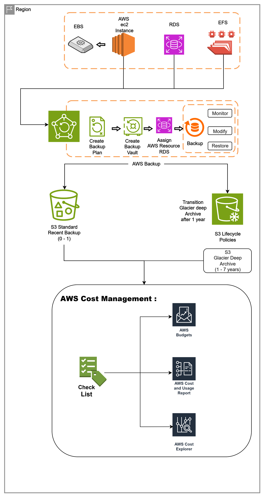

# 01 - Cost-Optimized Backup Solution

## Problem Statement

A company needs a **cost-optimized and automated backup solution** with lifecycle policies to ensure reliable data protection while minimizing long-term storage costs.

### Requirements

- **Backup:** AWS Backup (EC2, RDS, EFS)
- **Long-term Storage:** Amazon S3 with lifecycle management
- **Cost Management:** AWS Cost Explorer + AWS Budgets
- **Retention:** 1–7 years based on business and compliance requirements

---

## Solution

### Cost Optimization and Backup Strategy on AWS

Efficient data backup and cost management are critical for any cloud-based infrastructure. I designed an AWS backup architecture to ensure reliable backups while keeping long-term storage costs under control.

### Solution Architecture

**Architecture Flow:**
  
> EC2 / RDS / EFS → AWS Backup → Backup Storage → Lifecycle Management → Long-Term Retention  

> AWS Cost Explorer + AWS Budgets are used to monitor and control backup-related costs.

---

## Key Components

### AWS Backup

Used AWS Backup as a centralized backup service for:

- Amazon EC2
- Amazon EBS
- Amazon RDS
- Amazon EFS

Backup plans can be configured with scheduled backup jobs, retention periods, and lifecycle policies.

### Backup Lifecycle Management

Backup data is retained according to business requirements.

- Recent backups → Standard storage
- Long-term backups → Lower-cost archival storage
- Automatic lifecycle transitions based on retention requirements
- Retention period → **1–7 years**

### AWS Cost Management

Used AWS cost-management services to monitor and optimize backup spending:

- **AWS Cost Explorer** – Analyze and visualize AWS spending
- **AWS Budgets** – Set cost thresholds and receive alerts
- **AWS Cost and Usage Reports** – Detailed usage and cost analysis

---

## Benefits

- Automated backup scheduling
- Centralized backup management
- Long-term data retention
- Reduced storage costs through lifecycle management
- Transparent cost tracking and reporting
- Supports compliance and retention requirements
- Improved backup reliability and operational efficiency
