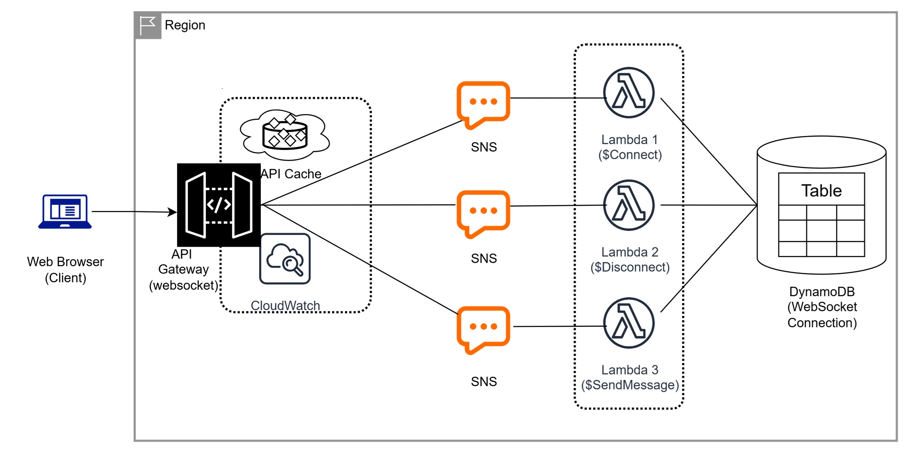

# 02 - Real-Time Chat Application

## Problem Statement

A startup wants a **real-time chat application** with low latency and scalable communication between users.

### Requirements

- **Real-Time Communication:** API Gateway (WebSocket)
- **Compute:** AWS Lambda
- **Connection Management:** DynamoDB
- **Notifications:** Amazon SNS
- **Scalability:** Serverless architecture with automatic scaling

---

## Solution

### Real-Time Chat Architecture on AWS

I designed a serverless real-time chat architecture using **API Gateway WebSocket APIs, AWS Lambda, DynamoDB, and Amazon SNS** to provide low-latency communication while minimizing infrastructure management.

### Solution Architecture

**Architecture Flow:**

> Client → API Gateway (WebSocket) → Lambda → DynamoDB → Connected Clients

> Amazon SNS is used for notification delivery when required.

---

## Key Components

### API Gateway (WebSocket)

Used API Gateway WebSocket APIs to establish persistent connections between clients and the backend.

- Maintains real-time connections
- Supports low-latency bidirectional communication
- Handles WebSocket routes such as `$connect`, `$disconnect`, and message events

### AWS Lambda

Used Lambda as the serverless backend for processing WebSocket events.

- Processes incoming messages
- Handles connection and disconnection events
- Retrieves connected client information
- Sends messages to connected users

### DynamoDB

Used DynamoDB to store and manage active WebSocket connection information.

- Stores connection IDs
- Provides fast and scalable access
- Supports tracking connected users
- Enables message routing to specific connections

### Amazon SNS

Used Amazon SNS for notification delivery when users need to be notified about chat events.

- Event-based notifications
- Decouples notification processing
- Supports scalable message delivery

---

## Benefits

- Low-latency real-time communication
- Serverless and automatically scalable architecture
- No infrastructure management for application servers
- Fast connection lookup using DynamoDB
- Event-driven architecture
- Supports large numbers of concurrent connections
- Cost-efficient for variable workloads
