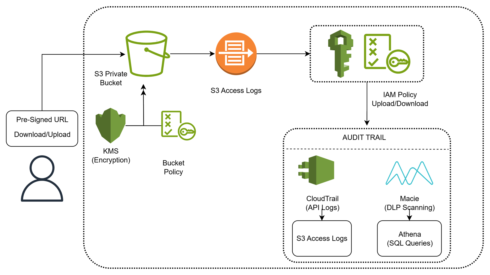

# 03 - Secure File Sharing with Audit Logs

## Problem Statement

A legal firm needs a **secure document-sharing solution** with strict access controls, encryption, and detailed audit logs to protect sensitive legal documents.

### Requirements

- **Secure Storage:** Amazon S3 (Bucket Policies + AWS KMS)
- **Access Control:** IAM + S3 Access Logs
- **Audit & Data Protection:** AWS CloudTrail + Amazon Macie (DLP)
- **Secure File Access:** Pre-signed URLs
- **Data Security:** Encryption and controlled access to sensitive documents

---

## Solution

### Secure File Sharing and Audit Strategy on AWS

I designed a secure serverless file-sharing architecture using **Amazon S3, AWS KMS, IAM, CloudTrail, Amazon Macie, and pre-signed URLs** to protect sensitive documents while providing controlled access and comprehensive auditability.

### Solution Architecture

**Architecture Flow:**

> User → IAM Authentication → Pre-signed URL → S3 → KMS Encryption

> S3 Access Logs + CloudTrail → Audit and Activity Monitoring

> Amazon Macie → Sensitive Data Discovery and DLP

---

## Key Components

### Amazon S3

Used Amazon S3 as the centralized and durable storage platform for legal documents.

- Bucket policies restrict unauthorized access
- Server-side encryption using AWS KMS
- Public access is blocked
- Documents are accessed through controlled mechanisms

### IAM + S3 Access Logs

Used IAM to enforce authentication and authorization for accessing documents.

- Least-privilege IAM permissions
- Role-based access control
- S3 access logging for object-level access tracking
- Prevents unauthorized document access

### AWS CloudTrail + Amazon Macie

Used CloudTrail and Macie to improve security visibility and data protection.

- **CloudTrail** – Records AWS API activity for auditing
- **Amazon Macie** – Discovers and identifies sensitive data in S3
- Helps monitor access to sensitive documents
- Supports security and compliance requirements

### Pre-signed URLs

Used S3 pre-signed URLs to provide temporary access to specific documents without exposing the S3 bucket publicly.

- Time-limited access
- Access to specific objects
- No public S3 bucket access required
- Useful for secure document sharing with external users

---

## Benefits

- Secure document storage
- Encryption using AWS KMS
- Least-privilege access control
- Temporary and controlled file sharing
- Detailed audit and access logging
- Sensitive data discovery using Amazon Macie
- Reduced risk of unauthorized document exposure
- Supports security and compliance requirements
