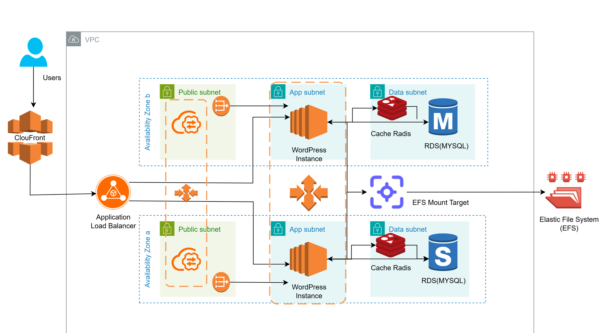

# 04 - Auto-Scaling WordPress Site

## Problem Statement

A news website running WordPress must **handle sudden traffic surges** while maintaining high availability, performance, and scalability.

### Requirements

- **Compute & Load Balancing:** EC2 Auto Scaling + Application Load Balancer (ALB)
- **Database:** Amazon RDS MySQL Multi-AZ
- **Caching:** Amazon ElastiCache for Redis
- **Shared Storage:** Amazon EFS
- **High Availability:** Multi-AZ architecture

---

## Solution

### Scalable and Highly Available WordPress Architecture on AWS

I designed a highly available and scalable WordPress architecture using **EC2 Auto Scaling, Application Load Balancer, RDS MySQL Multi-AZ, ElastiCache Redis, and Amazon EFS** to handle traffic spikes while maintaining application performance.

### Solution Architecture

**Architecture Flow:**

> Users → Application Load Balancer → EC2 Auto Scaling Group → WordPress

> WordPress → ElastiCache Redis → Faster Content and Object Retrieval

> WordPress → Amazon EFS → Shared WordPress Files

> WordPress → RDS MySQL Multi-AZ → Highly Available Database

---

## Key Components

### EC2 Auto Scaling + ALB

Used an Application Load Balancer to distribute incoming traffic across multiple WordPress EC2 instances.

- Distributes traffic across healthy instances
- Auto Scaling launches additional instances during traffic surges
- Automatically removes unhealthy instances
- Provides high availability across multiple Availability Zones

### RDS MySQL Multi-AZ

Used Amazon RDS for MySQL with Multi-AZ deployment for database high availability.

- Provides standby database infrastructure
- Automatic failover during primary database failure
- Managed database backups and maintenance
- Improves database availability and reliability

### ElastiCache for Redis

Used Redis caching to reduce repeated database queries and improve WordPress response times.

- Caches frequently accessed data
- Reduces database load
- Improves application response time
- Helps handle high request volumes

### Amazon EFS

Used Amazon EFS as shared storage for WordPress files across multiple EC2 instances.

- Shared filesystem accessible by multiple instances
- Stores WordPress media and shared application files
- Supports automatic scaling of storage
- Enables consistent file access across the Auto Scaling group

---

## Benefits

- Handles sudden traffic surges automatically
- High availability across multiple Availability Zones
- Improved WordPress performance using Redis caching
- Shared storage across multiple WordPress instances
- Highly available MySQL database
- Reduced single points of failure
- Scalable and resilient WordPress infrastructure
- Managed AWS services reduce operational overhead
