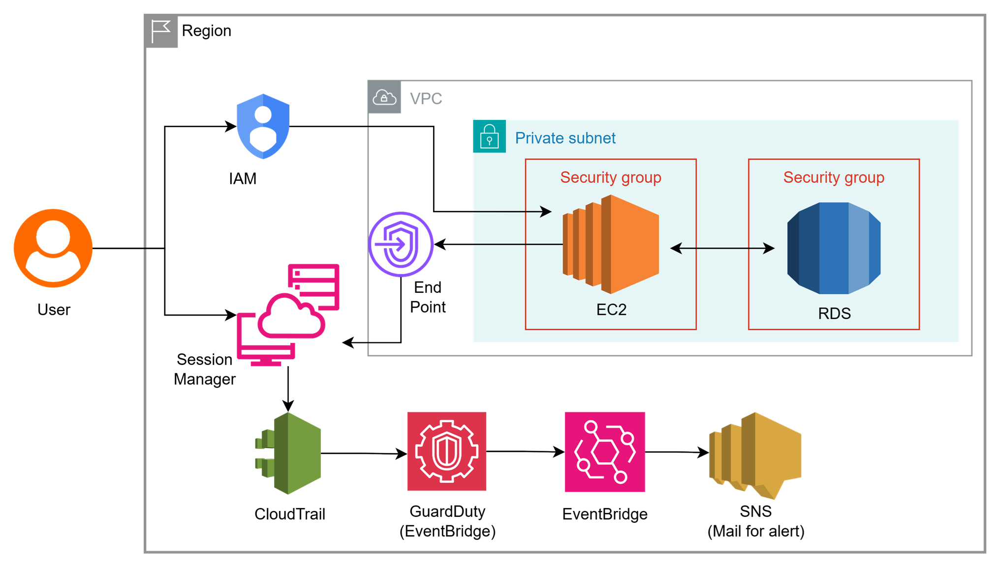

# 05 - Private VPC without Internet Access

## Problem Statement

A healthcare application must run in a **private and isolated AWS environment** with no direct internet access to reduce the attack surface and support security and compliance requirements.

### Requirements

- **Network Isolation:** VPC with Private Subnets
- **Database:** Amazon RDS in Private Subnets
- **Secure Administration:** AWS Systems Manager (SSM) Session Manager without a Bastion Host
- **Security Monitoring:** AWS CloudTrail + Amazon GuardDuty
- **Internet Access:** No direct inbound or outbound internet access

---

## Solution

### Secure Private VPC Architecture on AWS

I designed a private AWS architecture where application and database resources are isolated inside **private subnets**. Administrative access is provided through **SSM Session Manager**, eliminating the need for a publicly accessible bastion host.

### Solution Architecture

**Architecture Flow:**

> Users → Private Application → Private RDS

> Administrator → SSM Session Manager → Private EC2 Instance

> AWS CloudTrail → Activity Logging → Security Monitoring

> GuardDuty → Threat Detection → Security Findings

---

## Key Components

### VPC with Private Subnets

Used a dedicated VPC with private subnets to isolate application resources from direct internet access.

- Application resources run in private subnets
- No public IP addresses on private workloads
- Network access controlled using Security Groups and Network ACLs
- Reduces exposure to internet-based attacks

### Amazon RDS (Private)

Deployed the database in private subnets so it is not directly accessible from the public internet.

- No public database endpoint exposure
- Access restricted to authorized application resources
- Database traffic controlled using Security Groups
- Supports Multi-AZ deployment for high availability

### SSM Session Manager

Used AWS Systems Manager Session Manager for secure administrative access without deploying a Bastion Host.

- No SSH port exposed to the internet
- No bastion server required
- Centralized session management
- Session activity can be logged for auditing

### CloudTrail + GuardDuty

Used AWS CloudTrail and Amazon GuardDuty for security monitoring and threat detection.

- **CloudTrail** – Records AWS API activity for auditing
- **GuardDuty** – Continuously analyzes supported AWS data sources for potential threats
- Security findings can be monitored and investigated
- Improves visibility into suspicious activity

---

## Benefits

- Private and isolated application environment
- No public access to the database
- No Bastion Host required
- Reduced internet attack surface
- Centralized administrative access through SSM
- Continuous security monitoring
- Detailed API activity auditing
- Supports security and compliance requirements
