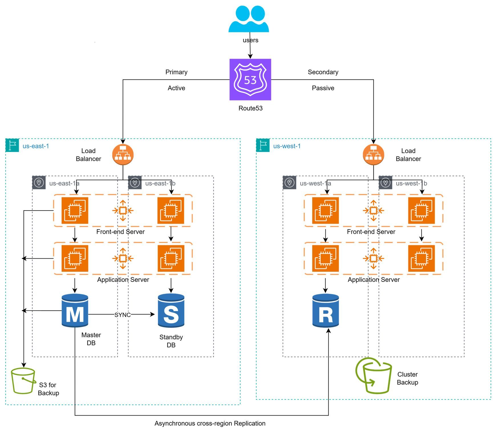

# 06 - Multi-Region Disaster Recovery (DR)

## Problem Statement

A financial application requires **high availability and disaster recovery** with minimal downtime and data loss in the event of an AWS Region failure.

### Requirements

- **Primary Region:** EC2 + RDS Multi-AZ
- **DR Region:** Pilot Light (RDS Read Replica + AMI Backups)
- **Traffic Routing:** Amazon Route 53 Weighted Routing
- **Recovery:** Ability to restore application capacity in the DR Region during a regional failure

---

## Solution

### Multi-Region Disaster Recovery Strategy on AWS

I designed a multi-region disaster recovery architecture using **EC2, RDS Multi-AZ, RDS Read Replica, AMI backups, and Amazon Route 53**. The primary region handles normal application traffic, while a lightweight pilot-light environment is maintained in the DR region for regional failure scenarios.

### Solution Architecture

**Architecture Flow:**

> Users → Route 53 → Primary Region → ALB → EC2 Auto Scaling → RDS Multi-AZ

> RDS → Cross-Region Read Replica → DR Region

> EC2 → AMI Backups → DR Region

> Regional Failure → Activate DR Environment → Route 53 → DR Region

---

## Key Components

### Primary Region - EC2 + RDS Multi-AZ

The primary region hosts the production application and database infrastructure.

- EC2 instances run the application
- Auto Scaling can maintain application availability
- RDS Multi-AZ provides database high availability
- Handles normal production traffic

### DR Region - Pilot Light

Maintained a lightweight environment in a secondary AWS Region that can be scaled up during a regional disaster.

- RDS Read Replica maintained in the DR Region
- AMI backups available to launch application instances
- Core infrastructure configuration is maintained
- Reduces recovery time compared with rebuilding the environment from scratch

### Amazon Route 53

Used Route 53 to control traffic routing between regions.

- Routes users to the primary region during normal operation
- Traffic can be redirected to the DR region during a regional failure
- Supports DNS-based failover and traffic management
- Helps reduce application downtime

---

## Benefits

- Multi-region disaster recovery capability
- Reduced downtime during regional failures
- Reduced data loss through cross-region database replication
- Faster application recovery using AMI backups
- High availability within the primary region
- Pilot-light approach reduces DR infrastructure costs
- DNS-based traffic management using Route 53
- Improved business continuity and resilience
