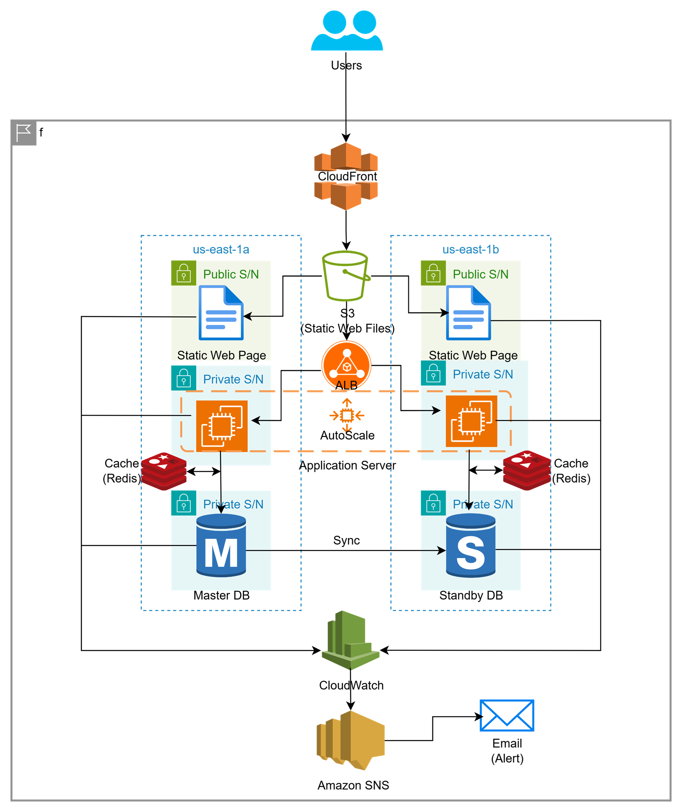

# 07 - Highly Available Web Application

## Problem Statement

A company wants to deploy a **three-tier web application** consisting of frontend, backend, and database layers that must provide **high availability (99.99% uptime)** across multiple Availability Zones (AZs).

### Requirements

- **Frontend:** Amazon S3 + CloudFront (Static Website)
- **Backend:** EC2 Auto Scaling Group behind an Application Load Balancer (ALB)
- **Database:** Multi-AZ Amazon RDS (MySQL/PostgreSQL)
- **Caching:** Amazon ElastiCache for Redis
- **Monitoring:** Amazon CloudWatch Alerts
- **High Availability:** Multi-AZ architecture

---

## Solution

### Highly Available Three-Tier Web Application on AWS

I designed a highly available three-tier architecture using **Amazon S3, CloudFront, EC2 Auto Scaling, ALB, RDS Multi-AZ, ElastiCache Redis, and CloudWatch**. The architecture distributes workloads across multiple Availability Zones to improve application availability and resilience.

### Solution Architecture

**Architecture Flow:**

> Users → CloudFront → S3 → Static Frontend

> Users → ALB → EC2 Auto Scaling Group → Backend Application

> Backend → ElastiCache Redis → Cached Data

> Backend → RDS Multi-AZ → MySQL/PostgreSQL Database

> CloudWatch → Monitoring → Alerts

---

## Key Components

### Amazon S3 + CloudFront

Used Amazon S3 to host static frontend content and Amazon CloudFront to distribute it globally.

- Stores HTML, CSS, JavaScript, and static assets
- CloudFront provides global content delivery
- Reduces latency for end users
- Improves frontend availability and scalability

### EC2 Auto Scaling + ALB

Used an Application Load Balancer to distribute backend traffic across EC2 instances running in multiple Availability Zones.

- Distributes traffic across healthy instances
- Auto Scaling adds or removes instances based on demand
- Health checks detect unhealthy instances
- Provides application-layer high availability

### RDS Multi-AZ

Used Amazon RDS with Multi-AZ deployment for the application's relational database.

- Provides standby database infrastructure
- Automatic failover during infrastructure failures
- Supports MySQL or PostgreSQL
- Improves database availability and resilience

### ElastiCache for Redis

Used Redis to cache frequently accessed application data.

- Reduces database queries
- Improves application response time
- Reduces database workload
- Helps handle high request volumes

### CloudWatch Alerts

Used Amazon CloudWatch to monitor application and infrastructure metrics.

- Monitors EC2, ALB, RDS, and other AWS resources
- Creates alarms based on defined thresholds
- Helps identify performance and availability issues
- Supports proactive operational monitoring

---

## Benefits

- Highly available three-tier architecture
- Multi-AZ application and database deployment
- Automatic scaling during traffic increases
- Improved application performance using Redis
- Global frontend delivery using CloudFront
- Database failover using RDS Multi-AZ
- Centralized monitoring and alerting
- Improved resilience and reduced single points of failure
